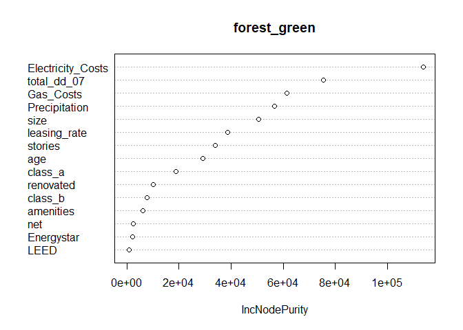

Predictive Model Building
=========================

Introduction
------------

There has been an increased focus on creating environmentally conscious
buildings, also known as green buildings, which adds a wrinkle into the
already complex decision-making process for commercial real estate firms
on what types of buildings they should construct. There are a variety of
potential benefits that could make investing in constructing green
buildings a worthwhile decision:

-   Lower operational costs (water, climate control, waste management,
    etc.).
-   Better indoor environments (natural sunlight for instance) could
    encourage better productivity and lead to happier and more motivated
    employees, increasing the incentives for a business to rent out
    those spaces.
-   Increased PR for both the real estate firm and the business renting
    the space due to positive public perceptions of green buildings.
-   Green buildings potentially have longer lives of operation. They are
    both physically constructed to last longer and less susceptible to
    energy market shocks.

While this list of benefits seems to make an airtight case for
commercial real estate firms to fully switch to constructing green
buildings, there is a major issue. Green buildings are generally more
costly for these firms to construct as a result of the standards that
must be met in order to achieve green building certification from LEED
or EnergyStar. However, as described above, it is possibly true that
business would be willing to pay hire rents for office space in green
buildings. This “Green Premium” would increase the profit incentives for
commercial real estate firms to construct green buildings, which could
be considered a societal good. However, we can’t be certain that the
“Green Premium” exists, or if so to what degree having a green certified
building would increase rent prices. This analysis has two main goals:

1.  Create the best predictive model possible for rent prices.
2.  Use said model to quantify the average change in rental income per
    sq. ft. associated with attaining green certification, holding any
    other features of the building constant.

Completing these two goals will give us a tool that we can employ to
predict rent prices for buildings given certain features, as well as
demonstrate to commercial real estate firms whether attempting to focus
future constructions projects on green buildings is financially worth
it. Given the uncertainty of the potential positive features listed
above, this is a good quantifiable method for providing evidence for or
against the impact of green certification on these companies’ decision
making processes.

Data and Model
--------------

For this analysis, we are using using a data set of 7894 commercial
rental properties in the U.S. Of these, 695 are certified as green
buildings through either LEED or EnergyStar. In this data set, each
green building is matched with a cluster of nearby non-green commercial
buildings. Data is collected for a variety of features about the
buildings, including rent in dollars per square foot, total square
footage, age of building, etc. We will use these features in order to
best predict building prices and quantify how much of a “Green Premium”
exists. To start, we want to first look at a summary of the differences
between different green classifications to give us a reference point for
future results.

    ##   LEED Energystar    N     Rent Leasing Rate      Age Class A % Class B %
    ## 1    0          0 7209 28.26678     81.97206 49.46733     36.22     48.48
    ## 2    0          1  631 30.04304     89.39591 23.20761     80.51     18.54
    ## 3    1          0   47 29.21043     87.42787 31.63830     68.09     29.79
    ## 4    1          1    7 32.99000     91.45286 29.00000     85.71     14.29

    ##   LEED Energystar Temp Control Days % w/ Amenities Precipitation
    ## 1    0          0          4703.402          50.76      31.26063
    ## 2    0          1          4110.742          74.64      28.46602
    ## 3    1          0          5488.660          44.68      38.54489
    ## 4    1          1          5484.857          85.71      32.04571

    ##   LEED Energystar  Gas Costs Electricity Costs
    ## 1    0          0 0.01135852        0.03089946
    ## 2    0          1 0.01097718        0.03191236
    ## 3    1          0 0.01253191        0.02771702
    ## 4    1          1 0.01204286        0.02772857

There are a lot of observations to make from these summary tables. A
simple glance at the rent column shows that rent appears to be higher in
green certified buildings than in non-green certified buildings.
However, there also seems to be a big difference in the rental rate
between EnergyStar certified buildings and LEED certified buildings,
0.8326173$ per square foot. Looking closer at these tables, there are
large differences in feature variables amongst the different populations
of building types. The starkest difference is in days of temperature
control, defined as the number of days where the building needs heating
or cooling. EnergyStar buildings need 592.6603176 days fewer of heating
or cooling than buildings with no green certification, but LEED
buildings actually need 785.257577 days more.

These differences necessitate more formal evaluations of the data.
Particularly, we will evaluate the effect of certification separately
for LEED and EnergyStar, as buildings that meet their respective
certifications seem to have different standards. To predict building
rent prices we will utilize random forest regression First, we split the
data into training and testing data, then use random forests to pick the
model with the lowest error. For robustness, we will test the error for
different numbers of trees in the random forest. However, we can’t use
random forests to quantify the effect of green certification on rent
prices, as large tree and forests are generally not interpretable in the
way we want. Therefore, we will utilize regression model selection
techniques to best estimate rent. To check robustness, we will compare
the simple model of rent regressed onto green certification with the
model identified through our selection process on out-of-sample
performance. Lastly, we will be controlling rent by cluster, by
normalizing rent values using the clustered rent values.

Results
-------

### Random Forest Model Errors

The model errors are high at low amounts of trees, flattening out at
around 100 trees, so we will use 100 trees in our random forest model.

### Variable Importance Plot

Random Forests, as well as other large tree regression methods, are
generally not interpretable. However, we can create measures of variable
importance to help understand which feature variables by looking at
which variables best improve error within the aggregated trees. Below is
a variable importance plot, ranked in order of importance.

    varImpPlot(forest_green)

Some of the most important variables are closely related since
electricity costs, total days of heating or cooling required,
precipitation amounts, and gas costs are all related to the running
costs of a building. Interestingly, some of the least important
variables are the green certification dummy variables, with EnergyStar
being slightly more important than LEED. This is potentially evidence
that having certification as a green building doesn’t have a large
impact on rental rates, but to be sure we will now check using stepwise
regression model selection.

### Green Premium

To start the stepwise selection process, we introduce a null model of
rent regressed onto the green building certification variables.

    ## 
    ## =============================================
    ##                       Dependent variable:    
    ##                   ---------------------------
    ##                            norm_rent         
    ## ---------------------------------------------
    ## LEED                       0.610***          
    ##                             (0.147)          
    ##                                              
    ## Energystar                 0.464***          
    ##                             (0.041)          
    ##                                              
    ## LEED:Energystar             -0.531           
    ##                             (0.397)          
    ##                                              
    ## Constant                   0.038***          
    ##                             (0.011)          
    ##                                              
    ## ---------------------------------------------
    ## Observations                 7,852           
    ## Log Likelihood            -10,913.180        
    ## Akaike Inf. Crit.         21,834.370         
    ## =============================================
    ## Note:             *p<0.1; **p<0.05; ***p<0.01

FIX THIS MATT In this regression, we get positive coefficients for each
of the green certification variables, but only EnergyStar
certification’s effect is statistically significant. LEED does not have
any significantly positive effect on rent in our simple model. To
compare, the following is the model picked by stepwise selection using
AIC as the loss function.

    final_green = glm(norm_rent ~ LEED + Energystar + class_a + size + class_b + Gas_Costs + 
        net + age + leasing_rate + amenities, data = green)

    stargazer(final_green, type="text")

    ## 
    ## =============================================
    ##                       Dependent variable:    
    ##                   ---------------------------
    ##                            norm_rent         
    ## ---------------------------------------------
    ## LEED                       0.352***          
    ##                             (0.130)          
    ##                                              
    ## Energystar                 0.179***          
    ##                             (0.040)          
    ##                                              
    ## class_a                    0.582***          
    ##                             (0.041)          
    ##                                              
    ## size                      0.00000***         
    ##                            (0.00000)         
    ##                                              
    ## class_b                    0.256***          
    ##                             (0.033)          
    ##                                              
    ## Gas_Costs                 -20.779***         
    ##                             (4.378)          
    ##                                              
    ## net                        -0.253***         
    ##                             (0.057)          
    ##                                              
    ## age                        -0.001***         
    ##                            (0.0004)          
    ##                                              
    ## leasing_rate               0.001***          
    ##                             (0.001)          
    ##                                              
    ## amenities                   0.061**          
    ##                             (0.024)          
    ##                                              
    ## Constant                   -0.230***         
    ##                             (0.073)          
    ##                                              
    ## ---------------------------------------------
    ## Observations                 7,852           
    ## Log Likelihood            -10,480.500        
    ## Akaike Inf. Crit.         20,983.010         
    ## =============================================
    ## Note:             *p<0.1; **p<0.05; ***p<0.01

In our final regression, we get positive significant values for LEED and
Energystar certification on our normalized rents. This means that LEED
certification is associated with a 0.352 standard deviation increase in
rent above the local cluster’s average rent and that Energystar
certification is associated with a 0.179 standard deviation increase in
rent above the local cluster’s average rent.

Conclusion
----------

With the two models described above, we have created two models: a
random forest for predicting price, the other a regression selection
model quantifying the average change in rental income per square foot
above average.

In the random forest model, the most important variables are feature
variables related to running costs, such as electricity costs, gas
costs, and total days of heating or cooling needed. Relatively less
important in our predictions are green certification (LEED and
EnergyStar), amenities, and utility pay structure (the variable “net”).
Of course, these less important variables are binary variables, which
means it’s less likely for them to reduce loss in these models anyways.
Overall, it seems that rent prices are generally related to the running
costs of a building, and less so on specific features of the commercial
buildings.

Our regression selection method produced a model that regressed the
cluster-normalized rent prices on a variety of feature variables,
including LEED and EnergyStar certification. We took the
cluster-normalized rents in this model in order to control for more
expensive areas while avoiding multicollinearity issues that would arise
from simply including clusterd rents in the regression model. Our
results show that LEED and EnergyStar green certification are associated
with increases in cluster-normalized rent prices, holding all else
constant. This means that there is a “Green Premium” where buildings
with green certifications have higher rents than those that don’t, even
if they have the same features. For future research, it would be prudent
to access data that distinctifies the specific rating levels for LEED
and EnergyStar green certification. Regression discontinuity methods
could then be utilized to determine if there is just a sharp increase in
rent prices, or if there is also a fuzzy increase after achieving
certification that continues to increase rents. If there is simply a
sharp increase, then the rent increase that we see isn’t necessarily
tied to the score given to a building, but just the actual distiction
between being certified and not being certified.

What Causes What?
=================

Question 1.
-----------

#### Why can’t I just get data from a few different cities and run the regression of “Crime” on “Police” to understand how more cops in the streets affect crime? (“Crime” refers to some measure of crime rate and “Police” measures the number of cops in a city.)

You can’t just run a regression of “amount of crime” on “amount of
police” because cities with high rates of crime have a clear incentive
to have more police officers. Since the amount of police officers is
usually based on the amount of crime, running OLS of “Crime” on “Police”
would get a positive coefficient, meaning that more police are
associated with more crime. This might literally be true, but not the
causal relationship we actually want to address

Question 2.
-----------

The UPenn researchers found that

Question 3.
-----------

Question 4.
-----------

Clustering and PCA
==================

Introduction
------------

Data and Model
--------------

Results
-------

Conclusion
----------

Market Segmentation
===================

Introduction
------------

Data and Model
--------------

Results
-------

Conclusion
----------
