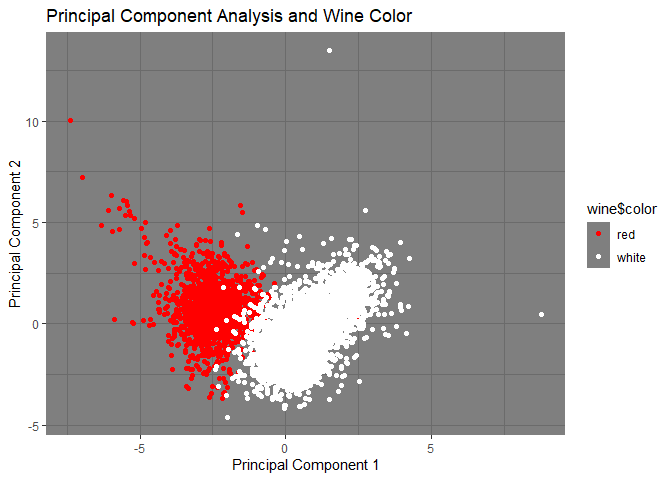
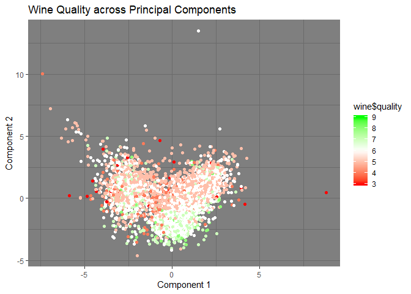

Predictive Model Building
=========================

Introduction
------------

There has been an increased focus on creating environmentally conscious
buildings, also known as green buildings, which adds a wrinkle into the
already complex decision-making process for commercial real estate firms
on what types of buildings they should construct. There are a variety of
potential benefits that could make investing in constructing green
buildings a worthwhile decision:

-   Lower operational costs (water, climate control, waste management,
    etc.).
-   Better indoor environments (natural sunlight for instance) could
    encourage better productivity and lead to happier and more motivated
    employees, increasing the incentives for a business to rent out
    those spaces.
-   Increased PR for both the real estate firm and the business renting
    the space due to positive public perceptions of green buildings.
-   Green buildings potentially have longer lives of operation. They are
    both physically constructed to last longer and less susceptible to
    energy market shocks.

While this list of benefits seems to make an airtight case for
commercial real estate firms to fully switch to constructing green
buildings, there is a major issue. Green buildings are generally more
costly for these firms to construct as a result of the standards that
must be met in order to achieve green building certification from LEED
or EnergyStar. However, as described above, it is possibly true that
business would be willing to pay hire rents for office space in green
buildings. This “Green Premium” would increase the profit incentives for
commercial real estate firms to construct green buildings, which could
be considered a societal good. However, we can’t be certain that the
“Green Premium” exists, or if so to what degree having a green certified
building would increase rent prices. This analysis has two main goals:

1.  Create the best predictive model possible for rent prices.
2.  Use said model to quantify the average change in rental income per
    sq. ft. associated with attaining green certification, holding any
    other features of the building constant.

Completing these two goals will give us a tool that we can employ to
predict rent prices for buildings given certain features, as well as
demonstrate to commercial real estate firms whether attempting to focus
future constructions projects on green buildings is financially worth
it. Given the uncertainty of the potential positive features listed
above, this is a good quantifiable method for providing evidence for or
against the impact of green certification on these companies’ decision
making processes.

Data and Model
--------------

For this analysis, we are using using a data set of 7894 commercial
rental properties in the U.S. Of these, 695 are certified as green
buildings through either LEED or EnergyStar. In this data set, each
green building is matched with a cluster of nearby non-green commercial
buildings. Data is collected for a variety of features about the
buildings, including rent in dollars per square foot, total square
footage, age of building, etc. We will use these features in order to
best predict building prices and quantify how much of a “Green Premium”
exists. To start, we want to first look at a summary of the differences
between different green classifications to give us a reference point for
future results.

    ##   LEED Energystar    N     Rent Leasing Rate      Age Class A % Class B %
    ## 1    0          0 7209 28.26678     81.97206 49.46733     36.22     48.48
    ## 2    0          1  631 30.04304     89.39591 23.20761     80.51     18.54
    ## 3    1          0   47 29.21043     87.42787 31.63830     68.09     29.79
    ## 4    1          1    7 32.99000     91.45286 29.00000     85.71     14.29

    ##   LEED Energystar Temp Control Days % w/ Amenities Precipitation
    ## 1    0          0          4703.402          50.76      31.26063
    ## 2    0          1          4110.742          74.64      28.46602
    ## 3    1          0          5488.660          44.68      38.54489
    ## 4    1          1          5484.857          85.71      32.04571

    ##   LEED Energystar  Gas Costs Electricity Costs
    ## 1    0          0 0.01135852        0.03089946
    ## 2    0          1 0.01097718        0.03191236
    ## 3    1          0 0.01253191        0.02771702
    ## 4    1          1 0.01204286        0.02772857

There are a lot of observations to make from these summary tables. A
simple glance at the rent column shows that rent appears to be higher in
green certified buildings than in non-green certified buildings.
However, there also seems to be a big difference in the rental rate
between EnergyStar certified buildings and LEED certified buildings,
0.8326173$ per square foot. Looking closer at these tables, there are
large differences in feature variables amongst the different populations
of building types. The starkest difference is in days of temperature
control, defined as the number of days where the building needs heating
or cooling. EnergyStar buildings need 592.6603176 days fewer of heating
or cooling than buildings with no green certification, but LEED
buildings actually need 785.257577 days more.

These differences necessitate more formal evaluations of the data.
Particularly, we will evaluate the effect of certification separately
for LEED and EnergyStar, as buildings that meet their respective
certifications seem to have different standards. To predict building
rent prices we will utilize random forest regression First, we split the
data into training and testing data, then use random forests to pick the
model with the lowest error. For robustness, we will test the error for
different numbers of trees in the random forest. However, we can’t use
random forests to quantify the effect of green certification on rent
prices, as large tree and forests are generally not interpretable in the
way we want. Therefore, we will utilize regression model selection
techniques to best estimate rent. To check robustness, we will compare
the simple model of rent regressed onto green certification with the
model identified through our selection process on out-of-sample
performance. Lastly, we will be controlling rent by cluster, by
normalizing rent values using the clustered rent values.

Results
-------

### Random Forest Model Errors

The model errors are high at low amounts of trees, flattening out at
around 100 trees, so we will use 100 trees in our random forest model.

### Variable Importance Plot

Random Forests, as well as other large tree regression methods, are
generally not interpretable. However, we can create measures of variable
importance to help understand which feature variables by looking at
which variables best improve error within the aggregated trees. Below is
a variable importance plot, ranked in order of importance.

Some of the most important variables are closely related since
electricity costs, total days of heating or cooling required,
precipitation amounts, and gas costs are all related to the running
costs of a building. Interestingly, some of the least important
variables are the green certification dummy variables, with EnergyStar
being slightly more important than LEED. This is potentially evidence
that having certification as a green building doesn’t have a large
impact on rental rates, but to be sure we will now check using stepwise
regression model selection.

### Green Premium

To start the stepwise selection process, we introduce a null model of
rent regressed onto the green building certification variables.

    ## 
    ## =============================================
    ##                       Dependent variable:    
    ##                   ---------------------------
    ##                            norm_rent         
    ## ---------------------------------------------
    ## LEED                       0.610***          
    ##                             (0.147)          
    ##                                              
    ## Energystar                 0.464***          
    ##                             (0.041)          
    ##                                              
    ## LEED:Energystar             -0.531           
    ##                             (0.397)          
    ##                                              
    ## Constant                   0.038***          
    ##                             (0.011)          
    ##                                              
    ## ---------------------------------------------
    ## Observations                 7,852           
    ## Log Likelihood            -10,913.180        
    ## Akaike Inf. Crit.         21,834.370         
    ## =============================================
    ## Note:             *p<0.1; **p<0.05; ***p<0.01

In this regression, we get positive coefficients for each of the green
certification variable with both estimates having statistical
significance at the 1% level. The estimated coefficient for the
interaction between the two green certificaiton dummy variables is not
statistically significant, most likely because there are only 7
buildings in the data that have both LEED and EnergyStar certification.
The following is the model found by stepwise selection using AIC as the
loss function.

    ## 
    ## =============================================
    ##                       Dependent variable:    
    ##                   ---------------------------
    ##                            norm_rent         
    ## ---------------------------------------------
    ## LEED                       0.352***          
    ##                             (0.130)          
    ##                                              
    ## Energystar                 0.179***          
    ##                             (0.040)          
    ##                                              
    ## class_a                    0.582***          
    ##                             (0.041)          
    ##                                              
    ## size                      0.00000***         
    ##                            (0.00000)         
    ##                                              
    ## class_b                    0.256***          
    ##                             (0.033)          
    ##                                              
    ## Gas_Costs                 -20.779***         
    ##                             (4.378)          
    ##                                              
    ## net                        -0.253***         
    ##                             (0.057)          
    ##                                              
    ## age                        -0.001***         
    ##                            (0.0004)          
    ##                                              
    ## leasing_rate               0.001***          
    ##                             (0.001)          
    ##                                              
    ## amenities                   0.061**          
    ##                             (0.024)          
    ##                                              
    ## Constant                   -0.230***         
    ##                             (0.073)          
    ##                                              
    ## ---------------------------------------------
    ## Observations                 7,852           
    ## Log Likelihood            -10,480.500        
    ## Akaike Inf. Crit.         20,983.010         
    ## =============================================
    ## Note:             *p<0.1; **p<0.05; ***p<0.01

In our final regression, we get positive significant values for LEED and
Energystar certification on our normalized rents. This means that LEED
certification is associated with a 0.352 standard deviation increase in
rent above the local cluster’s average rent and that Energystar
certification is associated with a 0.179 standard deviation increase in
rent above the local cluster’s average rent.

Conclusion
----------

With the two models described above, we have created two models: a
random forest for predicting price, the other a regression selection
model quantifying the average change in rental income per square foot
above average.

In the random forest model, the most important variables are feature
variables related to running costs, such as electricity costs, gas
costs, and total days of heating or cooling needed. Relatively less
important in our predictions are green certification (LEED and
EnergyStar), amenities, and utility pay structure (the variable “net”).
Of course, these less important variables are binary variables, which
means it’s less likely for them to reduce loss in these models anyways.
Overall, it seems that rent prices are generally related to the running
costs of a building, and less so on specific features of the commercial
buildings.

Our regression selection method produced a model that regressed the
cluster-normalized rent prices on a variety of feature variables,
including LEED and EnergyStar certification. We took the
cluster-normalized rents in this model in order to control for more
expensive areas while avoiding multicollinearity issues that would arise
from simply including clusterd rents in the regression model. Our
results show that LEED and EnergyStar green certification are associated
with increases in cluster-normalized rent prices, holding all else
constant. This means that there is a “Green Premium” where buildings
with green certifications have higher rents than those that don’t, even
if they have the same features. For future research, it would be prudent
to access data that distinctifies the specific rating levels for LEED
and EnergyStar green certification. Regression discontinuity methods
could then be utilized to determine if there is just a sharp increase in
rent prices, or if there is also a fuzzy increase after achieving
certification that continues to increase rents. If there is simply a
sharp increase, then the rent increase that we see isn’t necessarily
tied to the score given to a building, but just the actual distiction
between being certified and not being certified.

What Causes What?
=================

Question 1
----------

#### Why can’t I just get data from a few different cities and run the regression of “Crime” on “Police” to understand how more cops in the streets affect crime? (“Crime” refers to some measure of crime rate and “Police” measures the number of cops in a city.)

You can’t just run a regression of “amount of crime” on “amount of
police” because cities with high rates of crime have a clear incentive
to have more police officers. Since the amount of police officers is
usually based on the amount of crime, running OLS of “Crime” on “Police”
would get a positive coefficient, meaning that more police are
associated with more crime. This might literally be true, but not the
causal relationship we actually want to address.

Question 2
----------

#### How were the researchers from UPenn able to isolate this effect? Briefly describe their approach and discuss their result in the “Table 2” below, from the researchers’ paper.

The UPenn researchers got around the exogeneity problem mentioned in
question 1 by studying crime rates in D.C. as they relate to the
Terrorism Alert System (TAS). Since D.C. is a likely target of terrorist
attacks, on days where the TAS is at “High Alert” level, more police are
stationed on the National Mall. This large change in active police
officers in the area is unrelated to the amount of normal
(i.e. non-terrorism) crime in that area. Therefore, the researchers run
two regressions

1.  “Total number of crimes in D.C.” regressed onto “High Alert”
2.  “Total number of crimes in D.C.” regressed onto “High Alert” and
    “log midday metro ridership”

Regression 1 found that high-alert days are associated with a 7.316
decrease in crimes per day with 10% significancelevel. Regression 2
found that high-alert days are associated a 6.046 decrease in crimes per
day at a 10% significance level, and a 10% increase in midday metro
ridership is associated with a 1.7341 increase in daily crimes at a 5%
significance level. Since high-alert days have exogenously higher
amounts of police, we estimate that increases in active police officers
are associated with decreases in daily crime in D.C.

Question 3
----------

#### Why did they have to control for Metro ridership? What was that trying to capture?

The authors controlled for Metro ridership to hold constant the amount
of people in Washington D.C. on high-alert days. They did this to test
the concern that on high-alert days less people are on the National
Mall. Having fewer people on the mall, basically meaning that there are
less potential victims avaible, would mean that crime rates would fall
for a reason outside of the increased police forces. Therefore,
controlling for Metro ridership removes that causality from the error
term, giving us a more accurate estimate of the effect of police on
crime.

Question 4
----------

#### Below I am showing you “Table 4” from the researchers’ paper. Just focus on the first column of the table. Can you describe the model being estimated here? What is the conclusion?

In this model, they have split crime amounts into two categories: crime
in District 1 and crime in all other districts. District 1 in Washington
D.C. contains the National Mall, where most extra security is placed
during high-alert days. In the results, we see that while crime in all
other districts of D.C. dont experience any significant decrease during
high-alert days, crime in district 1 does at the 5% significance level,
controlling for metro ridership. This is stronger evidence for the
effect of police on crime, as the district with the most additional
police experiences the strongestdecline in daily crime rates.

Clustering and PCA
==================

Introduction
------------

There are two main type of wine: red and white. Besides the obvious
visual difference in color, how can we best determine what color a wine
is? Can we tell anything about the quality of that wine based on its
chemical properties. In this section, we will explore these questions
while determining which method of unsupervised learning works best for
this type of data science problem: clustering, or principal components
analysis.

Data and Model
--------------

The data we are working with consists of approximately 6500 wines with
the following recorded information:

-   Chemical properties of the wine, such as the amount of chlorides,
    pH, and acidity levels.
-   The quality of the wine as determined by a panel of “certified wine
    snobs” on a 1-10 scale.
-   Whether the wine is red or white.

To ensure that the unsupervised models are not biased by variables with
difference variances, we standardize all of the chemical properties.
This gives us 11 feature variables (chemical properties of the wine)
represented with *μ* = 0 and *σ*2 = 1.

In order to evaluate clustering and principal component analysis models
for determing wine color, we want to first set up a null model. In the
data set, there are 1599 observations of red wine and 4898 observations
of white wine. Since our model has more white wine observations than
red, the null model predicts white wine for each observation. The null
model has a 75.39% accuracy, the baseline that we will compare the other
models to.

Results
-------

### K-Means Clustering

In general, when using K-Means clustering, you want to evaluate the
model for differing numbers of clusters in order to determine which
gives the best balance between lowering within-cluster errors and not
overfitting the model. However, if you have knowledge about your data
and know what information you are looking for, it is generally best to
choose the number of clusters in a way that enables clear
interpretations. For our problem, it is clear that we should use 2
clusters since we’re looking for clusters that would represent the two
categories of wine that we have, red and white.

    ##        fixed.acidity     volatile.acidity          citric.acid 
    ##            8.2895922            0.5319416            0.2695435 
    ##       residual.sugar            chlorides  free.sulfur.dioxide 
    ##            2.6342666            0.0883238           15.7647596 
    ## total.sulfur.dioxide              density                   pH 
    ##           48.6396835            0.9967404            3.3097200 
    ##            sulphates              alcohol 
    ##            0.6567194           10.4015216

    ##        fixed.acidity     volatile.acidity          citric.acid 
    ##           6.85167903           0.27458385           0.33524928 
    ##       residual.sugar            chlorides  free.sulfur.dioxide 
    ##           6.39402555           0.04510424          35.52152864 
    ## total.sulfur.dioxide              density                   pH 
    ##         138.45848785           0.99400486           3.18762464 
    ##            sulphates              alcohol 
    ##           0.48880511          10.52235888

    ##        Color
    ## Cluster  red white
    ##       1 1575    68
    ##       2   24  4830

Since our clustering model is based off 11 variables, we can’t plot our
clustering with all 11 feature variables at the same time. Instead, we
show a visualization to demonstrate what clustering is doing.

This graph shows a slice of what is happening in our cluster model,
specifically the plane of sulphate amounts as the x-axis and total
sulfur dioxide as the y-axis. While the clusters aren’t automatically
assigned as “White Cluster” and “Red Cluster”, looking into the results
reveals that most red wines are in cluster 1 and most white wines are in
cluster 2. The shapes in the graph, though a bit hard to see, show that
our predictions are mostly accurate. While our model seems to show
intermingling the clusters, that is because they are actually separated
in the other dimensions that are projected onto the plane above.

Clustering is quite accurate in this scenario, with a 99% accruacy. This
mean clustering generates a lift of 1.3131715 over the null model.
However, it might not be the best model to use for this as the chemical
properties of a wine might vary with each other in ways that affect our
results.

### Principal Components Analysis

Principal Components Analysis (PCA) reduces the dimensionality of large
data sets by finding the linear combinations of the feature variables
that explain the most variation in the data points. As opposed to
clustering, it is much easier to visualize the results of PCA as the
process captures certain variations of all 11 features variables into
each principal component vector. In this visualization, we look at the
first two principal components.

 Our
principal component vectors do a fairly good job of separating red and
white wines. White wines tend to score more positively in principal
component 1 and a bit lower on average in principal component 2. But
what does that mean? To answer that, we have to see what are in our
principal components. \#\#\#\# Principal Component 1

    ##        fixed.acidity     volatile.acidity          citric.acid 
    ##          -0.23879890          -0.38075750           0.15238844 
    ##       residual.sugar            chlorides  free.sulfur.dioxide 
    ##           0.34591993          -0.29011259           0.43091401 
    ## total.sulfur.dioxide              density                   pH 
    ##           0.48741806          -0.04493664          -0.21868644 
    ##            sulphates              alcohol 
    ##          -0.29413517          -0.10643712

Wines that have higher principal component 1 values tend to be below
average in acidity and pH, and above average in sugar and sulfur
dioxide. Since we know that white whines generally score positive in
principal component 1, we know that white whines tend to be less acidic
and contain more sugar and sulfur dioxide on average than red wines.

#### Principal Component 2

    ##        fixed.acidity     volatile.acidity          citric.acid 
    ##           0.33635454           0.11754972           0.18329940 
    ##       residual.sugar            chlorides  free.sulfur.dioxide 
    ##           0.32991418           0.31525799           0.07193260 
    ## total.sulfur.dioxide              density                   pH 
    ##           0.08726628           0.58403734          -0.15586900 
    ##            sulphates              alcohol 
    ##           0.19171577          -0.46505769

Principal component 2, as our graph shows, helps to distinctify some of
the red and white wines in the “middle” of the data, so its likely that
red wines have higher values on average than white wines in the middle.
Wine density and alcohol amount are the most important variables in this
principal component as their rotation values are the highest in this
vector.

We can’t determine an accuracy rate the same way we did for clustering,
but we can look at how much variation these principle components
explain. The first principal component explains 27.54% of the variation,
the second principal component explains 22.67% of the variation. We have
also calculated that the third principal component explaines 14.15% of
the variation, giving us that the first three principal components
explain 64.36% of the total variation. Considering that we could add
more principal components, this model is a valid way of differentiating
red and white wines while allowing for highly correlated feature
variables to vary together.

Wine Quality
------------

Now that we have selected PCA as our method for quantifying differences
in white and red wine, we will see if this method is applicable to the
quality of the wine. The very idea of quantifying the quality of wine
has been a hotly debated topic. Experts in the wine industry claim that
they can very easily tell the difference between a finely-aged Cabernet
Sauvignon and a cheap variant that anyone could pick up in the store. Do
our principal components, based on objective measures of the chemical
properties of wine, tell us anything about the expert-judged quality of
the wine?

    qplot(scores[,1], scores[,2], color=wine$quality, xlab='Component 1', ylab='Component 2') + 
        labs(title="Wine Quality across Principal Components") + 
        scale_colour_gradient2(
      low = "red",
      mid = "white",
      high = "Green",
      midpoint = 6,
      space = "Lab",
      na.value = "grey50",
      guide = "colourbar",
      aesthetics = "colour"
    ) +
    theme_dark()

Principal component one does not tell us very much about quality, as
quality seems to be evenly distributed across the x-axis. However, there
seems to be negative correlation between principal component 2 and
quality. While quality is certainly a subjective topic, the chemical
properties found to be most important in the principal component 2 can
tell us what affects the subjective quality ratings. Primarily, wines
with more alcohol and less density tend to score worse in component 2,
which generally means these wines will more likely be considered as high
quality. While wine quality is certainly still a subjective measure,
there is at least some objective basis underlying the preferences of
wine critics.

Market Segmentation
===================

Introduction
------------

To help NutrientH20’s online-advertising campaigns, we want to identify
potential marketing segments to help better tailor your advertising to
the interests of consumers who are already interested in your product.
To do this, the advertising firm that has been running your online ad
campaign collected every tweet from a sample of your Twitter followers
and categorized each tweet’s content into 1 of 36 different pre-set
categories representing broad interest areas like sports, politics,
fashion, and so on. Using clustering methods, we will identify common
traits amongst groups of your followers so that you can tailor
advertisements to focus on those sets of intersets, increasing
interactions on your sponsored content which will increase NutrientH20’s
brand awareness and hopefully sales.

The data generating process involved contracted workers from Amazon’s
Mechanical Turk service categorize the content of each tweet, which
allows for potential errors. While generally reliable, we can’t expect
the data to be 100% accurate to what our sample audience is, as the
contractors could make mistakes in categorization. Another worry is spam
and pornographic bot accounts in the sample. While there were process to
remove like spam accounts, there is the possibility that spam accounts
do make it through. However, we looked through the data and there were
only 48 accounts marked as having made a spam post, with none having
more than 8% of posts marked as spam. This leaves us confident that
there are no spam bots in the sample we were given to analyze. As for
pornographic accounts, it’s hard to quantify since the category for
“adult” tweets is somewhat vague in it’s meaning. To be safe and err on
the side of not ruling out too many potential customers, we only removed
observations from the data that posted adult content 25% of the time or
more, approximately 70 of the 7882 accounts in the sample. This ensure
that we don’t bias the analyses with non-relevant pornographic accounts
without drastically shifting the composition of the data.

Results
-------

Our clustering analysis process led us to define 6 different clusters of
users, what we will define as marketing segments. One-by-one, we will
give quick explanations for each of these clusters. The important thing
to keep in mind with the cluster values we see below: positive numbers
mean users in that cluster have post frequencies in those categories
that are above the sample average. We will use these higher-than-average
post category frequencies to determine characteristics of the group.

    # Originally wasn't going to, but we need to scale the data to get better intuitions into what these clusters represent
    set.seed(14)
    social_freq_scaled = scale(social_freq, center=TRUE, scale=TRUE)

    clust6_social = kmeanspp(social_freq_scaled, k = 6, nstart = 25)

    Social_Cluster_1 = clust6_social$center[1,]
    Social_Cluster_2 = clust6_social$center[2,]
    Social_Cluster_3 = clust6_social$center[3,]
    Social_Cluster_4 = clust6_social$center[4,]
    Social_Cluster_5 = clust6_social$center[5,]
    Social_cluster_6 = clust6_social$center[6,]
    social_obs = nrow(social_freq_scaled)

### Cluster 1 - Beauty / Lifestyle

    ##          chatter   current_events           travel    photo_sharing 
    ##      -0.43696365      -0.16256461      -0.28483286      -0.42199755 
    ##    uncategorized          tv_film    sports_fandom         politics 
    ##      -0.20896349      -0.19301129       1.38984754      -0.38208596 
    ##             food           family  home_and_garden            music 
    ##       1.23923845       0.82412071      -0.07871086      -0.11700855 
    ##             news    online_gaming         shopping health_nutrition 
    ##      -0.26412566      -0.21683928      -0.30872812      -0.35235320 
    ##      college_uni   sports_playing          cooking              eco 
    ##      -0.29645605      -0.14727669      -0.35108687      -0.04237638 
    ##        computers         business         outdoors           crafts 
    ##      -0.09358104      -0.09756885      -0.25469394       0.23479800 
    ##       automotive              art         religion           beauty 
    ##      -0.09223795      -0.07072126       1.68210261       0.06739784 
    ##        parenting           dating           school personal_fitness 
    ##       1.53963195      -0.15959430       1.01375954      -0.31723751 
    ##          fashion   small_business 
    ##      -0.17740345      -0.07315778

There are 1124 in this cluster, or approximately 14.4 of our sample.
Accounts in this sample have relative high amounts of cooking, fashion,
and beauty content compared to the rest of the sample. This signifies a
focus on beauty and lifestyle, potentially having crossover influence
with Instagram as well. For accounts in this cluster, advertisements or
partnerships that focus on the health benefits of NutrientH20 would be
the best strategy.

### Cluster 2 - Working Professionals

    ##          chatter   current_events           travel    photo_sharing 
    ##      -0.43525631      -0.20985579      -0.26887220      -0.40958479 
    ##    uncategorized          tv_film    sports_fandom         politics 
    ##      -0.11514593      -0.24557868      -0.34828354      -0.33223604 
    ##             food           family  home_and_garden            music 
    ##       0.12868679      -0.25502824      -0.09335940      -0.14025894 
    ##             news    online_gaming         shopping health_nutrition 
    ##      -0.19082712      -0.21260938      -0.28952461       1.75510742 
    ##      college_uni   sports_playing          cooking              eco 
    ##      -0.33184124      -0.16004682       0.20680778       0.11865424 
    ##        computers         business         outdoors           crafts 
    ##      -0.18647424      -0.15249392       1.08985640      -0.12061959 
    ##       automotive              art         religion           beauty 
    ##      -0.27894054      -0.11830662      -0.29330529      -0.28752627 
    ##        parenting           dating           school personal_fitness 
    ##      -0.26699839       0.01908027      -0.29604757       1.62817621 
    ##          fashion   small_business 
    ##      -0.26406308      -0.17882083

There are 1370 in this cluster, or approximately -5.575205710^{-5},
-2.688046510^{-5}, -3.443988810^{-5}, -5.246378710^{-5},
-1.474906210^{-5}, -3.145621710^{-5}, -4.4611710^{-5},
-4.255617210^{-5}, 1.648351310^{-5}, -3.266661210^{-5},
-1.195842210^{-5}, -1.796579210^{-5}, -2.44430810^{-5},
-2.723317310^{-5}, -3.708525810^{-5}, 2.248120210^{-4},
-4.250560210^{-5}, -2.050042510^{-5}, 2.649004510^{-5},
1.519844210^{-5}, -2.388551810^{-5}, -1.953297310^{-5}, 1.39599910^{-4},
-1.545018510^{-5}, -3.572954310^{-5}, -1.515391510^{-5},
-3.756952610^{-5}, -3.682929110^{-5}, -3.419987110^{-5},
2.443994910^{-6}, -3.792078510^{-5}, 2.085533810^{-4},
-3.382388610^{-5}, -2.290519210^{-5} of our sample. Accounts in this
cluster have higher than average frequencise of news, politics,
automotive, computers, and travel content. This is a bit of a broader
category of people in various working professions, with a
cross-sectional interest in news and politics. Since these people are
generally using their twitter accounts for their work interests,
advertising to these accounts should focus on how NutrientH20 products
can improve work performance and focus.

### Cluster 3 - Parents

    ##          chatter   current_events           travel    photo_sharing 
    ##      -0.45976112      -0.18909696      -0.24601501       0.43163139 
    ##    uncategorized          tv_film    sports_fandom         politics 
    ##       0.01474455      -0.26751196      -0.40264970      -0.36507319 
    ##             food           family  home_and_garden            music 
    ##      -0.41913742      -0.23799863      -0.11384171       0.11766439 
    ##             news    online_gaming         shopping health_nutrition 
    ##      -0.28673372      -0.19897021      -0.18687212      -0.30502333 
    ##      college_uni   sports_playing          cooking              eco 
    ##      -0.23408441      -0.07054673       2.17700257      -0.19861065 
    ##        computers         business         outdoors           crafts 
    ##      -0.15914002      -0.03545645      -0.17787519      -0.17167937 
    ##       automotive              art         religion           beauty 
    ##      -0.20968885      -0.08944314      -0.30291145       1.76560614 
    ##        parenting           dating           school personal_fitness 
    ##      -0.28074090      -0.12032892      -0.09013375      -0.31527078 
    ##          fashion   small_business 
    ##       1.99441344      -0.05777160

There are 817 in this cluster, or approximately -5.889088310^{-5},
-2.422146310^{-5}, -3.151210610^{-5}, 5.52877410^{-5}, 1.888631710^{-6},
-3.426565410^{-5}, -5.157547110^{-5}, -4.676228910^{-5},
-5.368738510^{-5}, -3.048528610^{-5}, -1.458200510^{-5},
1.507165210^{-5}, -3.672777210^{-5}, -2.548612910^{-5},
-2.393648310^{-5}, -3.907049210^{-5}, -2.998391410^{-5},
-9.036343510^{-6}, 2.788526410^{-4}, -2.544007310^{-5},
-2.038427310^{-5}, -4.541623510^{-6}, -2.278406510^{-5},
-2.199044110^{-5}, -2.685908210^{-5}, -1.145678810^{-5},
-3.87999810^{-5}, 2.26156810^{-4}, -3.596015110^{-5}, -1.541295310^{-5},
-1.154524810^{-5}, -4.03830910^{-5}, 2.554647710^{-4}, -7.399974610^{-6}
of our sample. This cluster is centered around people who post more
about food, sports, school, religion, family, and parenting. We would
likely identify this cluster as parents considering the
higher-than-average frequencies of school, family, and parenting.
Marketing for these groups could invoke the health benefits of
NutrientH20 products for children, since parents would but for
themselves and for their children. As well, since this category contains
people who post a lot of sports content, endorsements from sports
celebrities could be influential for this cluster.

### Cluster 4 - General

    ##          chatter   current_events           travel    photo_sharing 
    ##      -0.37096498      -0.10691954       0.96819253      -0.47852966 
    ##    uncategorized          tv_film    sports_fandom         politics 
    ##      -0.14638071      -0.08789346       0.11716238       1.70674811 
    ##             food           family  home_and_garden            music 
    ##      -0.22840883      -0.08768092      -0.05520890      -0.17243437 
    ##             news    online_gaming         shopping health_nutrition 
    ##       1.51453506      -0.24686049      -0.36930539      -0.40328927 
    ##      college_uni   sports_playing          cooking              eco 
    ##      -0.26920648      -0.16412820      -0.39974815      -0.16060849 
    ##        computers         business         outdoors           crafts 
    ##       0.77463712      -0.01457678      -0.01401599      -0.13855066 
    ##       automotive              art         religion           beauty 
    ##       0.88163131      -0.18475597      -0.22923646      -0.28600659 
    ##        parenting           dating           school personal_fitness 
    ##      -0.10474552      -0.02497972      -0.20214425      -0.39128109 
    ##          fashion   small_business 
    ##      -0.34071706      -0.05216397

There are 1176 in this cluster, or approximately -4.751696910^{-5},
-1.369534310^{-5}, 1.240159510^{-4}, -6.129494810^{-5},
-1.874993110^{-5}, -1.125828810^{-5}, 1.500734910^{-5},
2.186176710^{-4}, -2.925692710^{-5}, -1.123106410^{-5},
-7.07171810^{-6}, -2.208714910^{-5}, 1.939970610^{-4},
-3.162040310^{-5}, -4.730439210^{-5}, -5.165739310^{-5},
-3.448270610^{-5}, -2.10232110^{-5}, -5.12038110^{-5}, -2.05723710^{-5},
9.922340410^{-5}, -1.867142810^{-6}, -1.795310910^{-6},
-1.774697810^{-5}, 1.129283110^{-4}, -2.366542410^{-5},
-2.936293810^{-5}, -3.663463510^{-5}, -1.341687210^{-5},
-3.19965710^{-6}, -2.589269310^{-5}, -5.011926310^{-5},
-4.364250710^{-5}, -6.681691510^{-6} of our sample. This is the largest
cluster in our sample and is defined by the lack of strong interests.
With the most frequent categories being chatter and photo sharing,
accounts in this cluster don’t have the same defined interests that
other clusters exhibit. Because of this, we would recommend to save
money by not use targeted advertising for these groups and instead
relying on your general advertising campaigns to reach these accounts.

### Cluster 5 - University Students / Gamers

    ##          chatter   current_events           travel    photo_sharing 
    ##       0.83068483       0.34364731      -0.04741045       0.56693904 
    ##    uncategorized          tv_film    sports_fandom         politics 
    ##       0.22946548       0.28259861      -0.26322652      -0.22052487 
    ##             food           family  home_and_garden            music 
    ##      -0.30685501      -0.07943274       0.16939035       0.12869875 
    ##             news    online_gaming         shopping health_nutrition 
    ##      -0.29323124      -0.24691734       0.60986895      -0.39196879 
    ##      college_uni   sports_playing          cooking              eco 
    ##      -0.16079113      -0.07645423      -0.36501913       0.14054325 
    ##        computers         business         outdoors           crafts 
    ##      -0.10543647       0.17574827      -0.33238273       0.12498121 
    ##       automotive              art         religion           beauty 
    ##      -0.09586977       0.19989068      -0.30118732      -0.22335749 
    ##        parenting           dating           school personal_fitness 
    ##      -0.30453647       0.14137956      -0.07248312      -0.34372958 
    ##          fashion   small_business 
    ##      -0.18719829       0.16582999

There are 2615 in this cluster, or approximately 1.064025710^{-4},
4.401784510^{-5}, -6.072812610^{-6}, 7.261932210^{-5}, 2.939227410^{-5},
3.619810610^{-5}, -3.371673210^{-5}, -2.824706910^{-5},
-3.930511210^{-5}, -1.017455310^{-5}, 2.169723910^{-5},
1.648504610^{-5}, -3.756004110^{-5}, -3.162768610^{-5},
7.811822110^{-5}, -5.020735110^{-5}, -2.059576410^{-5},
-9.793035310^{-6}, -4.675536410^{-5}, 1.800220910^{-5},
-1.350537610^{-5}, 2.251162610^{-5}, -4.257496210^{-5},
1.600886510^{-5}, -1.227997610^{-5}, 2.560403310^{-5},
-3.857913710^{-5}, -2.8609910^{-5}, -3.900812910^{-5}, 1.810933210^{-5},
-9.284375310^{-6}, -4.402838210^{-5}, -2.397826210^{-5},
2.124119310^{-5} of our sample. Accounts in this cluster tend to exhibit
higher than average post frequencies for online gaming, college, and
playing sports. In this instance, the sports category could be partially
referring to eSports, a competitive form of online gaming. Either way,
accounts in this cluster appear to consist mostly of college-aged people
who either game or play sports. It is likely that the people in this
cluster would be interested in drinks that improve mental focus without
causing burnout, which college students are prone to. Advertising
directly to those two needs would help to improve sales, while looking
at sponsoring eSports competitions or leagues could increase your
customer base.

Cluster 6 - Physical Fitness

    ##          chatter   current_events           travel    photo_sharing 
    ##     -0.387110470     -0.210188762     -0.177467771     -0.336143498 
    ##    uncategorized          tv_film    sports_fandom         politics 
    ##     -0.067134659      0.193350484     -0.291519099     -0.351163797 
    ##             food           family  home_and_garden            music 
    ##     -0.220900739     -0.101629415     -0.097373083      0.133015787 
    ##             news    online_gaming         shopping health_nutrition 
    ##     -0.314498844      2.317103063     -0.374709956     -0.368768146 
    ##      college_uni   sports_playing          cooking              eco 
    ##      2.434243530      1.184939557     -0.344237276     -0.186248730 
    ##        computers         business         outdoors           crafts 
    ##     -0.205084675     -0.134592108     -0.249417866     -0.173464318 
    ##       automotive              art         religion           beauty 
    ##     -0.182920798      0.013056302     -0.261261727     -0.289249359 
    ##        parenting           dating           school personal_fitness 
    ##     -0.306169654     -0.125927136     -0.330462811     -0.365178443 
    ##          fashion   small_business 
    ##     -0.252568935      0.002996711

There are 705 in this cluster, or approximately -4.958504810^{-5},
-2.692311510^{-5}, -2.273187810^{-5}, -4.30566810^{-5},
-8.599290310^{-6}, 2.476629710^{-5}, -3.734073310^{-5},
-4.498063210^{-5}, -2.829521410^{-5}, -1.30177310^{-5},
-1.247253510^{-5}, 1.703801610^{-5}, -4.028421210^{-5},
2.967981410^{-4}, -4.799666410^{-5}, -4.723557710^{-5},
3.118026810^{-4}, 1.517791210^{-4}, -4.409341310^{-5},
-2.385663210^{-5}, -2.626933210^{-5}, -1.723992710^{-5},
-3.194797810^{-5}, -2.221907510^{-5}, -2.343035710^{-5},
1.67238410^{-6}, -3.34650610^{-5}, -3.705000110^{-5}, -3.921732510^{-5},
-1.613002910^{-5}, -4.232903910^{-5}, -4.677577110^{-5},
-3.235159910^{-5}, 3.83849210^{-7} of our sample. Accounts in this
cluster feature posts that more heavily focus on the outdoors, health
and nutrition, and personal fitness. There are two obvious actions to
take for accounts in this cluster:

1.  Promote NutrientH20 products that have demonstrated positive health
    effects.
2.  For more influential accounts in this cluster, seek to request
    sponsored content.

Doing both of these will increase NutrientH20’s consumer base amongst
the health and fitness communities, which are generally more likely to
be interested in health drinks to begin with.

Conclusion
----------

Using cluster analysis, we have found 5 identifable marketing segments
amongst NutrientH20 twitter followers: Beauty/Lifestyle, Working
Professionals, Parents, University Students/Gamers, and Health/Fitness.
Utilizing effective targeted advertising towards these groups, focusing
on their common interests and specific needs, will help to increase
NutrientH20’s reach in these segments. As well, we have that accounts
more focused on simple chatter and sharing photos don’t have specific
interests that can be marketed to, meaning resources are better used not
focusing on those accounts. Overall, we believe that strategic
utilization of the results we have found using statistical clustering
methods and the suggestions we created from our findings will result in
increases for followers of NutrientH2O’s twitter account and sales of
NutrientH20 products.
